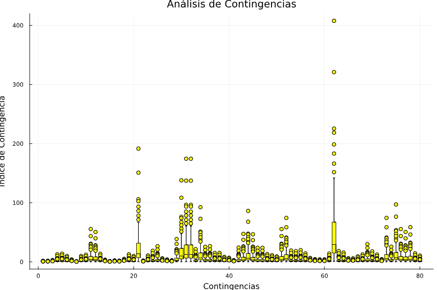

# 57-Bus System IEEE // Sistema IEEE de 57 Nodos

The base case to be analyzed is an **IEEE 57-bus system**, which was provided to obtain the **Ybus** matrix, taking into account the transformers in the system. Additionally, a load flow analysis will be performed using the **DC Power Flow method**. Finally, an **N-1 contingency analysis** will be conducted, from which a **Boxplot** will be generated to visualize the data obtained from the contingency analysis.

To clearly appreciate how critical the contingencies are in the system, the contingency index is used to see how affected the system is compared to its base case where no line is removed:
```math

PI = \sqrt{\left(\frac{P_{ij}^{post}}{P_{ij}^{pre}}\right)^2}
```

Donde:
- **$P_{ij}^{pre}$**: Power flow in line $ij$ before the contingency.
- **$P_{ij}^{post}$**:  Power flow in line $ij$ after the contingency.

### Explanation of the Formula

- **PI**: Contingency Index (Power Index). This index measures the impact of a contingency (such as the loss of a line) on the power system.
- **$P_{ij}^{post}$**: Power flow in line $ij$ after the contingency. That is, the power flowing through line $ij$ after a line has been removed from the system.
- **$P_{ij}^{pre}$**: Power flow in line $ij$ before the contingency. That is, the power flowing through line $ij$ in the base state of the system, with no lines removed.

### Interpretation of the Contingency Index (PI)

- **PI = 1**: Indicates that the power flow in line $ij$ has not changed due to the contingency. This means that the contingency has not had a significant impact on the power flow in that line.
- **PI > 1**: Indicates that the power flow in line $ij$ has increased due to the contingency. A higher PI value suggests a greater impact of the contingency on the power flow in that line.
- **PI < 1**: Indicates that the power flow in line $ij$ has decreased due to the contingency. A lower PI value suggests a lesser impact of the contingency on the power flow in that line.


It is important to note that, during this analysis, many of the constraints imposed by a real-world system will not be considered. For example, aspects such as the maximum flow capacity of transmission lines, the maximum generation capacity of generators, the maximum load of transformers, among others, will not be taken into account. This is done to simplify the analysis and focus on the fundamental aspects of the study.


//

El caso base que se analizará es un **sistema IEEE de 57 nodos**, el cual fue proporcionado para obtener la matriz **Ybus**, considerando los transformadores presentes en el sistema. Además, se realizará un análisis de flujo de carga utilizando el **método de Flujo DC**. Por último, se llevará a cabo un **análisis de contingencia N-1**, del cual se obtendrá un gráfico de **Boxplot** que permitirá visualizar los datos resultantes del análisis de contingencia.

Para apreciar claramente que tan criticas son las contingencias en el sistema se utiliza el indice de contingencia para ver que tan afectado se ve el sistema respecto a su caso base donde no se saca ninguna linea:

```math

PI = \sqrt{\left(\frac{P_{ij}^{post}}{P_{ij}^{pre}}\right)^2}
```

Donde:
- **$P_{ij}^{pre}$**: Potencia en la línea $ij$ antes de la contingencia.
- **$P_{ij}^{post}$**: Potencia en la línea $ij$ después de la contingencia.

### Explicación de la Fórmula

- **PI**: Índice de contingencia (Power Index). Este índice mide el impacto de una contingencia (como la pérdida de una línea) en el sistema de energía eléctrica.
- **$P_{ij}^{post}$**: Potencia de flujo en la línea $ij$ después de la contingencia. Es decir, la potencia que fluye a través de la línea $ij$ después de que una línea ha sido eliminada del sistema.
- **$P_{ij}^{pre}$**: Potencia de flujo en la línea $ij$ antes de la contingencia. Es decir, la potencia que fluye a través de la línea $ij$ en el estado base del sistema, sin ninguna línea eliminada.

### Interpretación del Índice de Contingencia (PI)

- **PI = 1**: Indica que la potencia de flujo en la línea $ij$ no ha cambiado debido a la contingencia. Esto significa que la contingencia no ha tenido un impacto significativo en el flujo de potencia en esa línea.
- **PI > 1**: Indica que la potencia de flujo en la línea $ij$ ha aumentado debido a la contingencia. Un valor mayor de PI sugiere un mayor impacto de la contingencia en el flujo de potencia en esa línea.
- **PI < 1**: Indica que la potencia de flujo en la línea $ij$ ha disminuido debido a la contingencia. Un valor menor de PI sugiere un menor impacto de la contingencia en el flujo de potencia en esa línea.

Es importante mencionar que, durante este análisis, no se tendrán en cuenta muchas de las restricciones que un sistema real impondría. Por ejemplo, no se considerarán aspectos como la capacidad máxima de flujo en las líneas, la generación máxima de los generadores, la carga máxima de los transformadores, entre otros. Esto se hace con el fin de simplificar el análisis y centrarse en los aspectos fundamentales del estudio.

Es importante mencionar que, durante este análisis, no se tendrán en cuenta muchas de las restricciones que un sistema real impondría. Por ejemplo, no se considerarán aspectos como la capacidad máxima de flujo en las líneas, la generación máxima de los generadores, la carga máxima de los transformadores, entre otros. Esto se hace con el fin de simplificar el análisis y centrarse en los aspectos fundamentales del estudio.

___

___

## Archivos de Entrada

### Datos de lineas `lines.csv`
Tabla con las siguientes columnas:
|   FROM |   TO |   TYPE |      R |      X |      B |   LIM1 |   LIM2 |   LIM3 |   TAP |   TAPMIN |   TAPMAX |   STEP |   TANG |
|-------:|-----:|-------:|-------:|-------:|-------:|-------:|-------:|-------:|------:|---------:|---------:|-------:|-------:|
|      1 |    2 |      0 | 0.0083 | 0.028  | 0.129  |      0 |      0 |      0 | 0     |        0 |        0 |      0 |      0 |
|      2 |    3 |      0 | 0.0298 | 0.085  | 0.0818 |      0 |      0 |      0 | 0     |        0 |        0 |      0 |      0 |
|      3 |    4 |      0 | 0.0112 | 0.0366 | 0.038  |      0 |      0 |      0 | 0     |        0 |        0 |      0 |      0 |
|      4 |    5 |      0 | 0.0625 | 0.132  | 0.0258 |      0 |      0 |      0 | 0     |        0 |        0 |      0 |      0 |
|      4 |    6 |      0 | 0.043  | 0.148  | 0.0348 |      0 |      0 |      0 | 0     |        0 |        0 |      0 |      0 |
|      6 |    7 |      0 | 0.02   | 0.102  | 0.0276 |      0 |      0 |      0 | 0     |        0 |        0 |      0 |      0 |
|      6 |    8 |      0 | 0.0339 | 0.173  | 0.047  |      0 |      0 |      0 | 0     |        0 |        0 |      0 |      0 |
|      8 |    9 |      0 | 0.0099 | 0.0505 | 0.0548 |      0 |      0 |      0 | 0     |        0 |        0 |      0 |      0 |
|      9 |   10 |      0 | 0.0369 | 0.1679 | 0.044  |      0 |      0 |      0 | 0     |        0 |        0 |      0 |      0 |
|      9 |   11 |      0 | 0.0258 | 0.0848 | 0.0218 |      0 |      0 |      0 | 0     |        0 |        0 |      0 |      0 |
|      9 |   12 |      0 | 0.0648 | 0.295  | 0.0772 |      0 |      0 |      0 | 0     |        0 |        0 |      0 |      0 |
|      9 |   13 |      0 | 0.0481 | 0.158  | 0.0406 |      0 |      0 |      0 | 0     |        0 |        0 |      0 |      0 |
|     13 |   14 |      0 | 0.0132 | 0.0434 | 0.011  |      0 |      0 |      0 | 0     |        0 |        0 |      0 |      0 |
|     13 |   15 |      0 | 0.0269 | 0.0869 | 0.023  |      0 |      0 |      0 | 0     |        0 |        0 |      0 |      0 |
|      1 |   15 |      0 | 0.0178 | 0.091  | 0.0988 |      0 |      0 |      0 | 0     |        0 |        0 |      0 |      0 |
|      1 |   16 |      0 | 0.0454 | 0.206  | 0.0546 |      0 |      0 |      0 | 0     |        0 |        0 |      0 |      0 |
|      1 |   17 |      0 | 0.0238 | 0.108  | 0.0286 |      0 |      0 |      0 | 0     |        0 |        0 |      0 |      0 |
|      3 |   15 |      0 | 0.0162 | 0.053  | 0.0544 |      0 |      0 |      0 | 0     |        0 |        0 |      0 |      0 |
|      4 |   18 |      0 | 0      | 0.555  | 0      |      0 |      0 |      0 | 0.97  |        0 |        0 |      0 |      0 |
|      4 |   18 |      0 | 0      | 0.43   | 0      |      0 |      0 |      0 | 0.978 |        0 |        0 |      0 |      0 |
|      5 |    6 |      0 | 0.0302 | 0.0641 | 0.0124 |      0 |      0 |      0 | 0     |        0 |        0 |      0 |      0 |
|      7 |    8 |      0 | 0.0139 | 0.0712 | 0.0194 |      0 |      0 |      0 | 0     |        0 |        0 |      0 |      0 |
|     10 |   12 |      0 | 0.0277 | 0.1262 | 0.0328 |      0 |      0 |      0 | 0     |        0 |        0 |      0 |      0 |
|     11 |   13 |      0 | 0.0223 | 0.0732 | 0.0188 |      0 |      0 |      0 | 0     |        0 |        0 |      0 |      0 |
|     12 |   13 |      0 | 0.0178 | 0.058  | 0.0604 |      0 |      0 |      0 | 0     |        0 |        0 |      0 |      0 |
|     12 |   16 |      0 | 0.018  | 0.0813 | 0.0216 |      0 |      0 |      0 | 0     |        0 |        0 |      0 |      0 |
|     12 |   17 |      0 | 0.0397 | 0.179  | 0.0476 |      0 |      0 |      0 | 0     |        0 |        0 |      0 |      0 |
|     14 |   15 |      0 | 0.0171 | 0.0547 | 0.0148 |      0 |      0 |      0 | 0     |        0 |        0 |      0 |      0 |
|     18 |   19 |      0 | 0.461  | 0.685  | 0      |      0 |      0 |      0 | 0     |        0 |        0 |      0 |      0 |
|     19 |   20 |      0 | 0.283  | 0.434  | 0      |      0 |      0 |      0 | 0     |        0 |        0 |      0 |      0 |
|     21 |   20 |      0 | 0      | 0.7767 | 0      |      0 |      0 |      0 | 1.043 |        0 |        0 |      0 |      0 |
|     21 |   22 |      0 | 0.0736 | 0.117  | 0      |      0 |      0 |      0 | 0     |        0 |        0 |      0 |      0 |
|     22 |   23 |      0 | 0.0099 | 0.0152 | 0      |      0 |      0 |      0 | 0     |        0 |        0 |      0 |      0 |
|     23 |   24 |      0 | 0.166  | 0.256  | 0.0084 |      0 |      0 |      0 | 0     |        0 |        0 |      0 |      0 |
|     24 |   25 |      0 | 0      | 1.182  | 0      |      0 |      0 |      0 | 1     |        0 |        0 |      0 |      0 |
|     24 |   25 |      0 | 0      | 1.23   | 0      |      0 |      0 |      0 | 1     |        0 |        0 |      0 |      0 |
|     24 |   26 |      0 | 0      | 0.0473 | 0      |      0 |      0 |      0 | 1.043 |        0 |        0 |      0 |      0 |
|     26 |   27 |      0 | 0.165  | 0.254  | 0      |      0 |      0 |      0 | 0     |        0 |        0 |      0 |      0 |
|     27 |   28 |      0 | 0.0618 | 0.0954 | 0      |      0 |      0 |      0 | 0     |        0 |        0 |      0 |      0 |
|     28 |   29 |      0 | 0.0418 | 0.0587 | 0      |      0 |      0 |      0 | 0     |        0 |        0 |      0 |      0 |
|      7 |   29 |      0 | 0      | 0.0648 | 0      |      0 |      0 |      0 | 0.967 |        0 |        0 |      0 |      0 |
|     25 |   30 |      0 | 0.135  | 0.202  | 0      |      0 |      0 |      0 | 0     |        0 |        0 |      0 |      0 |
|     30 |   31 |      0 | 0.326  | 0.497  | 0      |      0 |      0 |      0 | 0     |        0 |        0 |      0 |      0 |
|     31 |   32 |      0 | 0.507  | 0.755  | 0      |      0 |      0 |      0 | 0     |        0 |        0 |      0 |      0 |
|     32 |   33 |      0 | 0.0392 | 0.036  | 0      |      0 |      0 |      0 | 0     |        0 |        0 |      0 |      0 |
|     34 |   32 |      0 | 0      | 0.953  | 0      |      0 |      0 |      0 | 0.975 |        0 |        0 |      0 |      0 |
|     34 |   35 |      0 | 0.052  | 0.078  | 0.0032 |      0 |      0 |      0 | 0     |        0 |        0 |      0 |      0 |
|     35 |   36 |      0 | 0.043  | 0.0537 | 0.0016 |      0 |      0 |      0 | 0     |        0 |        0 |      0 |      0 |
|     36 |   37 |      0 | 0.029  | 0.0366 | 0      |      0 |      0 |      0 | 0     |        0 |        0 |      0 |      0 |
|     37 |   38 |      0 | 0.0651 | 0.1009 | 0.002  |      0 |      0 |      0 | 0     |        0 |        0 |      0 |      0 |
|     37 |   39 |      0 | 0.0239 | 0.0379 | 0      |      0 |      0 |      0 | 0     |        0 |        0 |      0 |      0 |
|     36 |   40 |      0 | 0.03   | 0.0466 | 0      |      0 |      0 |      0 | 0     |        0 |        0 |      0 |      0 |
|     22 |   38 |      0 | 0.0192 | 0.0295 | 0      |      0 |      0 |      0 | 0     |        0 |        0 |      0 |      0 |
|     11 |   41 |      0 | 0      | 0.749  | 0      |      0 |      0 |      0 | 0.955 |        0 |        0 |      0 |      0 |
|     41 |   42 |      0 | 0.207  | 0.352  | 0      |      0 |      0 |      0 | 0     |        0 |        0 |      0 |      0 |
|     41 |   43 |      0 | 0      | 0.412  | 0      |      0 |      0 |      0 | 0     |        0 |        0 |      0 |      0 |
|     38 |   44 |      0 | 0.0289 | 0.0585 | 0.002  |      0 |      0 |      0 | 0     |        0 |        0 |      0 |      0 |
|     15 |   45 |      0 | 0      | 0.1042 | 0      |      0 |      0 |      0 | 0.955 |        0 |        0 |      0 |      0 |
|     14 |   46 |      0 | 0      | 0.0735 | 0      |      0 |      0 |      0 | 0.9   |        0 |        0 |      0 |      0 |
|     46 |   47 |      0 | 0.023  | 0.068  | 0.0032 |      0 |      0 |      0 | 0     |        0 |        0 |      0 |      0 |
|     47 |   48 |      0 | 0.0182 | 0.0233 | 0      |      0 |      0 |      0 | 0     |        0 |        0 |      0 |      0 |
|     48 |   49 |      0 | 0.0834 | 0.129  | 0.0048 |      0 |      0 |      0 | 0     |        0 |        0 |      0 |      0 |
|     49 |   50 |      0 | 0.0801 | 0.128  | 0      |      0 |      0 |      0 | 0     |        0 |        0 |      0 |      0 |
|     50 |   51 |      0 | 0.1386 | 0.22   | 0      |      0 |      0 |      0 | 0     |        0 |        0 |      0 |      0 |
|     10 |   51 |      0 | 0      | 0.0712 | 0      |      0 |      0 |      0 | 0.93  |        0 |        0 |      0 |      0 |
|     13 |   49 |      0 | 0      | 0.191  | 0      |      0 |      0 |      0 | 0.895 |        0 |        0 |      0 |      0 |
|     29 |   52 |      0 | 0.1442 | 0.187  | 0      |      0 |      0 |      0 | 0     |        0 |        0 |      0 |      0 |
|     52 |   53 |      0 | 0.0762 | 0.0984 | 0      |      0 |      0 |      0 | 0     |        0 |        0 |      0 |      0 |
|     53 |   54 |      0 | 0.1878 | 0.232  | 0      |      0 |      0 |      0 | 0     |        0 |        0 |      0 |      0 |
|     54 |   55 |      0 | 0.1732 | 0.2265 | 0      |      0 |      0 |      0 | 0     |        0 |        0 |      0 |      0 |
|     11 |   43 |      0 | 0      | 0.153  | 0      |      0 |      0 |      0 | 0.958 |        0 |        0 |      0 |      0 |
|     44 |   45 |      0 | 0.0624 | 0.1242 | 0.004  |      0 |      0 |      0 | 0     |        0 |        0 |      0 |      0 |
|     40 |   56 |      0 | 0      | 1.195  | 0      |      0 |      0 |      0 | 0.958 |        0 |        0 |      0 |      0 |
|     56 |   41 |      0 | 0.553  | 0.549  | 0      |      0 |      0 |      0 | 0     |        0 |        0 |      0 |      0 |
|     56 |   42 |      0 | 0.2125 | 0.354  | 0      |      0 |      0 |      0 | 0     |        0 |        0 |      0 |      0 |
|     39 |   57 |      0 | 0      | 1.355  | 0      |      0 |      0 |      0 | 0.98  |        0 |        0 |      0 |      0 |
|     57 |   56 |      0 | 0.174  | 0.26   | 0      |      0 |      0 |      0 | 0     |        0 |        0 |      0 |      0 |
|     38 |   49 |      0 | 0.115  | 0.177  | 0.003  |      0 |      0 |      0 | 0     |        0 |        0 |      0 |      0 |
|     38 |   48 |      0 | 0.0312 | 0.0482 | 0      |      0 |      0 |      0 | 0     |        0 |        0 |      0 |      0 |
|      9 |   55 |      0 | 0      | 0.1205 | 0      |      0 |      0 |      0 | 0.94  |        0 |        0 |      0 |      0 |


### Dtos de nodos `nodes.csv`

Tabla con las siguientes columnas:

|   NUMBER | NAME         |   TYPE |   VPU |    ANG |   PLOAD |   QLOAD |   PGEN |   QGEN |   KVBASE |   QMIN |   QMAX |   G |     B |   ID |
|---------:|:-------------|-------:|------:|-------:|--------:|--------:|-------:|-------:|---------:|-------:|-------:|----:|------:|-----:|
|        1 | Kanawha   V1 |      3 | 1.04  |   0    |   0.55  |   0.17  |  1.289 | -0.161 |        0 |   0    |   0    |   0 | 0     |    1 |
|        2 | Turner    V1 |      2 | 1.01  |  -1.18 |   0.03  |   0.88  |  0     | -0.008 |        0 |  -0.17 |   0.5  |   0 | 0     |    2 |
|        3 | Logan     V1 |      2 | 0.985 |  -5.97 |   0.41  |   0.21  |  0.4   | -0.01  |        0 |  -0.1  |   0.6  |   0 | 0     |    3 |
|        4 | Sprigg    V1 |      0 | 0.981 |  -7.32 |   0     |   0     |  0     |  0     |        0 |   0    |   0    |   0 | 0     |    4 |
|        5 | Bus 5     V1 |      0 | 0.976 |  -8.52 |   0.13  |   0.04  |  0     |  0     |        0 |   0    |   0    |   0 | 0     |    5 |
|        6 | Beaver Ck V1 |      2 | 0.98  |  -8.65 |   0.75  |   0.02  |  0     |  0.008 |        0 |  -0.08 |   0.25 |   0 | 0     |    6 |
|        7 | Bus 7     V1 |      0 | 0.984 |  -7.58 |   0     |   0     |  0     |  0     |        0 |   0    |   0    |   0 | 0     |    7 |
|        8 | Clinch Rv V1 |      2 | 1.005 |  -4.45 |   1.5   |   0.22  |  4.5   |  0.621 |        0 |  -1.4  |   2    |   0 | 0     |    8 |
|        9 | Saltville V1 |      2 | 0.98  |  -9.56 |   1.21  |   0.26  |  0     |  0.022 |        0 |  -0.03 |   0.09 |   0 | 0     |    9 |
|       10 | Bus 10    V1 |      0 | 0.986 | -11.43 |   0.05  |   0.02  |  0     |  0     |        0 |   0    |   0    |   0 | 0     |   10 |
|       11 | Tazewell  V1 |      0 | 0.974 | -10.17 |   0     |   0     |  0     |  0     |        0 |   0    |   0    |   0 | 0     |   11 |
|       12 | Glen Lyn  V1 |      2 | 1.015 | -10.46 |   3.77  |   0.24  |  3.1   |  1.285 |        0 |  -1.5  |   1.55 |   0 | 0     |   12 |
|       13 | Bus 13    V1 |      0 | 0.979 |  -9.79 |   0.18  |   0.023 |  0     |  0     |        0 |   0    |   0    |   0 | 0     |   13 |
|       14 | Bus 14    V1 |      0 | 0.97  |  -9.33 |   0.105 |   0.053 |  0     |  0     |        0 |   0    |   0    |   0 | 0     |   14 |
|       15 | Bus 15    V1 |      0 | 0.988 |  -7.18 |   0.22  |   0.05  |  0     |  0     |        0 |   0    |   0    |   0 | 0     |   15 |
|       16 | Bus 16    V1 |      0 | 1.013 |  -8.85 |   0.43  |   0.03  |  0     |  0     |        0 |   0    |   0    |   0 | 0     |   16 |
|       17 | Bus 17    V1 |      0 | 1.017 |  -5.39 |   0.42  |   0.08  |  0     |  0     |        0 |   0    |   0    |   0 | 0     |   17 |
|       18 | Sprigg    V2 |      0 | 1.001 | -11.71 |   0.272 |   0.098 |  0     |  0     |        0 |   0    |   0    |   0 | 0.1   |   18 |
|       19 | Bus 19    V2 |      0 | 0.97  | -13.2  |   0.033 |   0.006 |  0     |  0     |        0 |   0    |   0    |   0 | 0     |   19 |
|       20 | Bus 20    V2 |      0 | 0.964 | -13.41 |   0.023 |   0.01  |  0     |  0     |        0 |   0    |   0    |   0 | 0     |   20 |
|       21 | Bus 21    V3 |      0 | 1.008 | -12.89 |   0     |   0     |  0     |  0     |        0 |   0    |   0    |   0 | 0     |   21 |
|       22 | Bus 22    V3 |      0 | 1.01  | -12.84 |   0     |   0     |  0     |  0     |        0 |   0    |   0    |   0 | 0     |   22 |
|       23 | Bus 23    V3 |      0 | 1.008 | -12.91 |   0.063 |   0.021 |  0     |  0     |        0 |   0    |   0    |   0 | 0     |   23 |
|       24 | Bus 24    V3 |      0 | 0.999 | -13.25 |   0     |   0     |  0     |  0     |        0 |   0    |   0    |   0 | 0     |   24 |
|       25 | Bus 25    V4 |      0 | 0.982 | -18.13 |   0.063 |   0.032 |  0     |  0     |        0 |   0    |   0    |   0 | 0.059 |   25 |
|       26 | Bus 26    V5 |      0 | 0.959 | -12.95 |   0     |   0     |  0     |  0     |        0 |   0    |   0    |   0 | 0     |   26 |
|       27 | Bus 27    V5 |      0 | 0.982 | -11.48 |   0.093 |   0.005 |  0     |  0     |        0 |   0    |   0    |   0 | 0     |   27 |
|       28 | Bus 28    V5 |      0 | 0.997 | -10.45 |   0.046 |   0.023 |  0     |  0     |        0 |   0    |   0    |   0 | 0     |   28 |
|       29 | Bus 29    V5 |      0 | 1.01  |  -9.75 |   0.17  |   0.026 |  0     |  0     |        0 |   0    |   0    |   0 | 0     |   29 |
|       30 | Bus 30    V4 |      0 | 0.962 | -18.68 |   0.036 |   0.018 |  0     |  0     |        0 |   0    |   0    |   0 | 0     |   30 |
|       31 | Bus 31    V4 |      0 | 0.936 | -19.34 |   0.058 |   0.029 |  0     |  0     |        0 |   0    |   0    |   0 | 0     |   31 |
|       32 | Bus 32    V4 |      0 | 0.949 | -18.46 |   0.016 |   0.008 |  0     |  0     |        0 |   0    |   0    |   0 | 0     |   32 |
|       33 | Bus 33    V4 |      0 | 0.947 | -18.5  |   0.038 |   0.019 |  0     |  0     |        0 |   0    |   0    |   0 | 0     |   33 |
|       34 | Bus 34    V3 |      0 | 0.959 | -14.1  |   0     |   0     |  0     |  0     |        0 |   0    |   0    |   0 | 0     |   34 |
|       35 | Bus 35    V3 |      0 | 0.966 | -13.86 |   0.06  |   0.03  |  0     |  0     |        0 |   0    |   0    |   0 | 0     |   35 |
|       36 | Bus 36    V3 |      0 | 0.976 | -13.59 |   0     |   0     |  0     |  0     |        0 |   0    |   0    |   0 | 0     |   36 |
|       37 | Bus 37    V3 |      0 | 0.985 | -13.41 |   0     |   0     |  0     |  0     |        0 |   0    |   0    |   0 | 0     |   37 |
|       38 | Bus 38    V3 |      0 | 1.013 | -12.71 |   0.14  |   0.07  |  0     |  0     |        0 |   0    |   0    |   0 | 0     |   38 |
|       39 | Bus 39    V3 |      0 | 0.983 | -13.46 |   0     |   0     |  0     |  0     |        0 |   0    |   0    |   0 | 0     |   39 |
|       40 | Bus 40    V3 |      0 | 0.973 | -13.62 |   0     |   0     |  0     |  0     |        0 |   0    |   0    |   0 | 0     |   40 |
|       41 | Tazewell  V6 |      0 | 0.996 | -14.05 |   0.063 |   0.03  |  0     |  0     |        0 |   0    |   0    |   0 | 0     |   41 |
|       42 | Bus 42    V6 |      0 | 0.966 | -15.5  |   0.071 |   0.044 |  0     |  0     |        0 |   0    |   0    |   0 | 0     |   42 |
|       43 | Tazewell  V7 |      0 | 1.01  | -11.33 |   0.02  |   0.01  |  0     |  0     |        0 |   0    |   0    |   0 | 0     |   43 |
|       44 | Bus 44    V3 |      0 | 1.017 | -11.86 |   0.12  |   0.018 |  0     |  0     |        0 |   0    |   0    |   0 | 0     |   44 |
|       45 | Bus 45    V3 |      0 | 1.036 |  -9.25 |   0     |   0     |  0     |  0     |        0 |   0    |   0    |   0 | 0     |   45 |
|       46 | Bus 46    V3 |      0 | 1.05  | -11.89 |   0     |   0     |  0     |  0     |        0 |   0    |   0    |   0 | 0     |   46 |
|       47 | Bus 47    V3 |      0 | 1.033 | -12.49 |   0.297 |   0.116 |  0     |  0     |        0 |   0    |   0    |   0 | 0     |   47 |
|       48 | Bus 48    V3 |      0 | 1.027 | -12.59 |   0     |   0     |  0     |  0     |        0 |   0    |   0    |   0 | 0     |   48 |
|       49 | Bus 49    V3 |      0 | 1.036 | -12.92 |   0.18  |   0.085 |  0     |  0     |        0 |   0    |   0    |   0 | 0     |   49 |
|       50 | Bus 50    V3 |      0 | 1.023 | -13.39 |   0.21  |   0.105 |  0     |  0     |        0 |   0    |   0    |   0 | 0     |   50 |
|       51 | Bus 51    V3 |      0 | 1.052 | -12.52 |   0.18  |   0.053 |  0     |  0     |        0 |   0    |   0    |   0 | 0     |   51 |
|       52 | Bus 52    V5 |      0 | 0.98  | -11.47 |   0.049 |   0.022 |  0     |  0     |        0 |   0    |   0    |   0 | 0     |   52 |
|       53 | Bus 53    V5 |      0 | 0.971 | -12.23 |   0.2   |   0.1   |  0     |  0     |        0 |   0    |   0    |   0 | 0.063 |   53 |
|       54 | Bus 54    V5 |      0 | 0.996 | -11.69 |   0.041 |   0.014 |  0     |  0     |        0 |   0    |   0    |   0 | 0     |   54 |
|       55 | Saltville V5 |      0 | 1.031 | -10.78 |   0.068 |   0.034 |  0     |  0     |        0 |   0    |   0    |   0 | 0     |   55 |
|       56 | Bus 56    V6 |      0 | 0.968 | -16.04 |   0.076 |   0.022 |  0     |  0     |        0 |   0    |   0    |   0 | 0     |   56 |
|       57 | Bus 57    V6 |      0 | 0.965 | -16.56 |   0.067 |   0.02  |  0     |  0     |        0 |   0    |   0    |   0 | 0     |   57 |
## Funciones


### `calcular_ybus()`
**Descripción (Description):**
Calcula la matriz de admitancia nodal sin considerar transformadores.

**Entradas (Inputs):**
- `lin`: DataFrame con los datos de las líneas.
- `nod`: DataFrame con los datos de los nodos.

**Salidas (Outputs):**
- `Ybus`: Matriz de admitancias nodales.

### `calcular_ybus_2()`
**Descripción (Description):**
Calcula la matriz de admitancia nodal considerando transformadores con taps.

**Entradas (Inputs):**
- `lin`: DataFrame con los datos de las líneas.
- `nod`: DataFrame con los datos de los nodos.

**Salidas (Outputs):**
- `Ybus`: Matriz de admitancias nodales con transformadores.

### `carga_datos()`
**Descripción (Description):**
Carga los datos de las líneas y nodos desde archivos CSV y los convierte en DataFrames.

**Entradas (Inputs):**
- Ninguna.

**Salidas (Outputs):**
- `lin`: DataFrame con los datos de las líneas.
- `nod`: DataFrame con los datos de los nodos.
- `num_lin`: Número de líneas.
- `num_nod`: Número de nodos.

### `crear_vector_P()`
**Descripción (Description):**
Crea el vector de potencias netas en cada nodo del sistema.

**Entradas (Inputs):**
- `lin`: DataFrame con los datos de las líneas.
- `nod`: DataFrame con los datos de los nodos.

**Salidas (Outputs):**
- `P`: Vector de potencias netas normalizado.

### `flujo_potencia_DC()`
**Descripción (Description):**
Calcula el flujo de potencia en un sistema de energía eléctrica utilizando un modelo de flujo de carga en corriente continua (DC).

**Entradas (Inputs):**
- `Ykm`: Matriz de admitancias.
- `P`: Vector de potencias.
- `num_lin`: Número de líneas.
- `num_nod`: Número de nodos.
- `lin`: DataFrame con los datos de las líneas.

**Salidas (Outputs):**
- `d`: Vector de ángulos de voltaje en los nodos.
- `pf`: Vector de flujos de potencia en las líneas.

### `Contingencia()`
**Descripción (Description):**
Realiza el análisis de contingencias en el sistema de energía eléctrica, eliminando una línea a la vez y calculando el flujo de potencia resultante.

**Entradas (Inputs):**
- `num_lin`: Número de líneas.
- `Ykm`: Matriz de admitancias.
- `P`: Vector de potencias.
- `num_nod`: Número de nodos.
- `lin`: DataFrame con los datos de las líneas.

**Salidas (Outputs):**
- `almacenamiento`: Matriz con los flujos de potencia para cada contingencia.
- `almrank`: Matriz con los índices de contingencia.

### `graficar_contingencias()`
**Descripción (Description):**
Grafica los análisis de contingencias utilizando boxplots.

**Entradas (Inputs):**
- `rank`: Matriz con los índices de contingencia.
- `num_conting`: Número de contingencias.

**Salidas (Outputs):**
- Ninguna (muestra el gráfico).

### `main()`
**Descripción (Description):**
Función principal que coordina la carga de datos, el cálculo de la matriz de admitancias, el flujo de potencia en operación normal, el análisis de contingencias y la visualización de resultados.

**Entradas (Inputs):**
- Ninguna.

**Salidas (Outputs):**
- Ninguna (muestra los resultados en la consola y gráficos).


**Graficos obtenidos/Graphics obtains**

___

___


**Licencias**

<p xmlns:cc="http://creativecommons.org/ns#" xmlns:dct="http://purl.org/dc/terms/"><span property="dct:title">Flujo de carga DC y analisis de contingencias</span> by <span property="cc:attributionName">Yohan V.</span> is licensed under <a href="https://creativecommons.org/licenses/by/4.0/?ref=chooser-v1" target="_blank" rel="license noopener noreferrer" style="display:inline-block;">CC BY 4.0</a></p>
